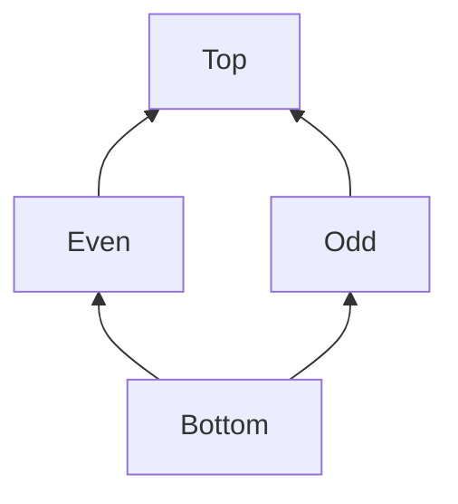

You can read this file as a Readme Github Page at [https://github.com/FZhg/cfg-parity-analysis](https://github.com/FZhg/cfg-parity-analysis).

# ECE654 Assignment 2

I implemented a static Parity analysis tool for the Java programming language on top of the [Dataflow Project of the Checker Framework](https://checkerframework.org/manual/checker-framework-dataflow-manual.pdf). There are 4 essential components to define a dataflow analysis with monotone framework:
* A lattice ($L$, $\sqsubseteq$)
* An abstraction function $\alpha$
* A transfer function $f$
* An initial dataflow analysis assumptions, $\sigma_0$

## Lattice, $L$

## Abstract Functions, $\alpha$

### Integer
$$ \alpha(n: Integer Literal)  =
\begin{cases}
Even & if n is Even \\
Odd & if n is Odd   \\
\end{cases} $$

### Integer Addition and Subtraction
|        | $\bot$ | Even   | Odd    | $\top$ |
|--------|--------|--------|--------|--------|
| $\bot$ | $\bot$ | $\bot$ | $\bot$ | $\bot$ |
| Even   | $\bot$ | Even   | Odd    | $\top$ |
| Odd    | $\bot$ | Odd    | Even   | $\top$ |
| $\top$ | $\bot$ | $\top$ | $\top$ | $\top$ |

### Integer Multiplication
|        | $\bot$ | Even   | Odd    | $\top$ |
|--------|--------|--------|--------|--------|
| $\bot$ | $\bot$ | $\bot$ | $\bot$ | $\bot$ |
| Even   | $\bot$ | Even   | Even   | $\top$ |
| Odd    | $\bot$ | Even   | Odd    | $\top$ |
| $\top$ | $\bot$ | $\top$ | $\top$ | $\top$ |

### Integer Division
Return  $\bot$ no matter the operands are. 

## Transfer Function, $f$

$$f(n: Integer Literal) = \sigma[n -> alpha]$$

# References
[Claire Le Goues Jonathan Aldrich and Rohan Padhye. Program analysis. 2022.](https://cmu-program-analysis.github.io/2023/resources/program-analysis.pdf)

[Anders Møller and Michael I Schwartzbach. Static program analysis. 2022.](https://cs.au.dk/~amoeller/spa/spa.pdf)

[Checker Framework Contributors. A Dataflow Framework for Java. 2023.](https://checkerframework.org/manual/checker-framework-dataflow-manual.pdf)