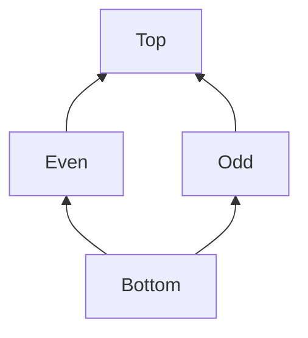
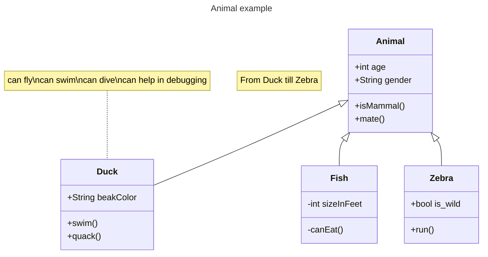

I implemented a static parity analysis tool for the Java programming language on top of the [Dataflow Project of the Checker Framework](https://checkerframework.org/manual/checker-framework-dataflow-manual.pdf).

# Repository Link
You can read this file as a Readme Github Page at [https://github.com/FZhg/cfg-parity-analysis](https://github.com/FZhg/cfg-parity-analysis).

# CI Execution of Test Cases

# Observation on the [Dataflow Project of the Checker Framework](https://checkerframework.org/manual/checker-framework-dataflow-manual.pdf).
The developers who wants to use the Dataflow library should be careful to override their own `object.equals` and `object.hashcode` methods for the `Store`. (I had a bug because of this!)
The work-list algorithm use these to detect fixed-point.

The terminology of `Store` is misleading. In web or app development, a data store is usually a single source of data. This instance should be a singleton. 
 'Snapshot' could be a better name for the dataflow information at each program point. 

# High Level Description of My  Implementation

 There are 4 essential components to define a dataflow analysis with monotone framework:
* A lattice ($L$, $\sqsubseteq$)
* An abstraction function $\alpha$
* A transfer function $f$
* An initial dataflow analysis assumptions, $\sigma_0$


## Lattice, $L$


## Abstract Functions, $\alpha$

### Integer
$$ \alpha_{int}(n: Integer Literal)  =
\begin{cases}
Even & \text{n is Even} \\
Odd &  \text{n is Odd}   \\
\end{cases} $$

### Integer Addition and Subtraction
|        | $\bot$ | Even   | Odd    | $\top$ |
|--------|--------|--------|--------|--------|
| $\bot$ | $\bot$ | $\bot$ | $\bot$ | $\bot$ |
| Even   | $\bot$ | Even   | Odd    | $\top$ |
| Odd    | $\bot$ | Odd    | Even   | $\top$ |
| $\top$ | $\bot$ | $\top$ | $\top$ | $\top$ |

### Integer Multiplication
|        | $\bot$ | Even   | Odd    | $\top$ |
|--------|--------|--------|--------|--------|
| $\bot$ | $\bot$ | $\bot$ | $\bot$ | $\bot$ |
| Even   | $\bot$ | Even   | Even   | $\top$ |
| Odd    | $\bot$ | Even   | Odd    | $\top$ |
| $\top$ | $\bot$ | $\top$ | $\top$ | $\top$ |

### Integer Division
Return  $\top$ no matter the operands are. 


## Transfer Function, $f$

$$f(n: Integer Literal) = \sigma[n \mapsto \alpha_{int}(n)]$$


$$f(a = b: Assignment) =  \sigma[\sigma(a) \mapsto \sigma(b)]$$

$$f(a + b: Integer Addition) =  \sigma[\sigma(a+b) \mapsto \alpha_{Integer Addition}(\sigma(a), \sigma(b))]$$

$$f(a - b: Integer Subtraction) =  \sigma[\sigma(a-b) \mapsto \alpha_{Integer Subtraction}(\sigma(a), \sigma(b))]$$

$$f(a * b: Integer Multiplication) =  \sigma[\sigma(a-b) \mapsto \alpha_{Integer Multiplication}(\sigma(a), \sigma(b))]$$

$$f(a \div b: Integer Division) =  \sigma[\sigma(a \div b) \mapsto \top)]$$

$$f(+ a : Integer Plus) =  \sigma[\sigma(+a) \mapsto \sigma(a)]$$

$$f(- a : Integer Minus) =  \sigma[\sigma(-a) \mapsto \sigma(a)]$$

Otherwise,
$$f(Expression) =  \sigma$$

## Initial Dataflow Information Assumptions, $sigma_0$
For all parameters and local variables, $$\sigma_0(x) = \top$$

## Forward Analysis
Parity Analysis  is neither must or may analysis. Unlike Live Variable Analysis, which maps a program point to a set of variables,  
or Reaching Definitions,  which maps a program point to a set of definitions,  Parity Analysis maps a program point to a map of variables and their parity. In other words, the abstract state lattice of Parity Analysis is not a powerset.

Parity Analysis is a forward Analysis. Because It uses the dataflow information from predecessors to compute the dataflow information after the current program point. 
Any change to the dataflow information, the work-list algorithm have to update the successor's dataflow information.

# AST or CFG?

If I had implemented the parity analysis on AST, then all the flow-sensitive information would be gone. 
```java
public class Test(){
    public int  test(){
        int a = 1;
        int a= 2;
        return a;
    }
}
```



In conclusion, the parity analysis should be implemented on CFG.

# Refinement (Implementation TBD)
## The EqualTo & UnequalTo boolean expression

## Integer Lattice + Parity Lattice

## Float, Double, Short and Long Literal

# False Postive and False Negative


# Credit

I reused a lot of code from [constant propagation](https://github.com/typetools/checker-framework/tree/master/dataflow/src/main/java/org/checkerframework/dataflow/constantpropagation).

# References
[Claire Le Goues Jonathan Aldrich and Rohan Padhye. Program analysis. 2022.](https://cmu-program-analysis.github.io/2023/resources/program-analysis.pdf)

[Anders Møller and Michael I Schwartzbach. Static program analysis. 2022.](https://cs.au.dk/~amoeller/spa/spa.pdf)

[Checker Framework Contributors. A Dataflow Framework for Java. 2023.](https://checkerframework.org/manual/checker-framework-dataflow-manual.pdf)